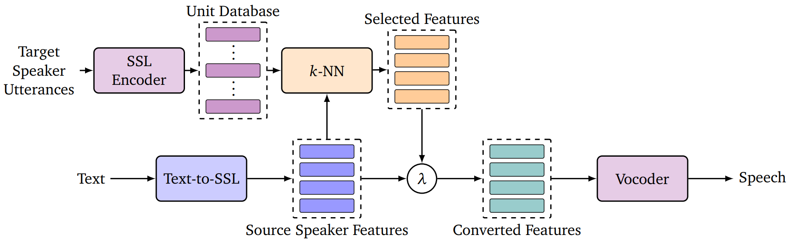

<!--
SPDX-FileCopyrightText: 2024 Idiap Research Institute
SPDX-FileContributor: Karl El Hajal

SPDX-License-Identifier: MIT
-->

# kNN Retrieval for Simple and Effective Zero-Shot Multi-speaker Text-to-Speech

[](https://arxiv.org/abs/2408.10771)
[](LICENSES/MIT.txt)

[](https://huggingface.co/spaces/karlhajal/kNN-TTS)

[](https://huggingface.co/Idiap/kNN-TTS)


Simple and lightweight Zero-shot Text-to-Speech (TTS) synthesis model. It leverages self-supervised learning (SSL) features and kNN retrieval methods to achieve robust zero-shot synthesis, matching the performance of state-of-the-art models that are more complex and trained on much larger datasets of transcribed speech. The kNN-TTS framework's low training requirements make it suitable for developing zero-shot multi-speaker models in low-resource settings. Additionally, it offers voice morphing capabilities with precise control over the output using an interpolation parameter, allowing for seamless blending of source and target speech styles.



## Table of Contents
- [Installation](#installation)
- [Synthesis](#synthesis)
- [Training](#training)
- [Acknowledgements](#acknowledgements)
- [Citation](#citation)

## Installation

Install Poetry:
```bash
pip install poetry
```

Clone the repo and install the dependencies:
```bash
git clone git@github.com:idiap/knn-tts.git
cd knn-tts
poetry install
```

## Synthesis

Example:
```python
from huggingface_hub import snapshot_download

from knn_tts.synthesizer import Synthesizer
from knn_tts.utils import get_vocoder_checkpoint_path

CHECKPOINTS_DIR = "checkpoints"

# Download and Get Path to Model Checkpoints
tts_checkpoints_dir = snapshot_download(repo_id="idiap/knn-tts", local_dir=CHECKPOINTS_DIR)
vocoder_checkpoint_path = get_vocoder_checkpoint_path(CHECKPOINTS_DIR)

# Load Synthesizer
tts_checkpoint_name = "best_model_646135.pth"
synthesizer = Synthesizer(tts_checkpoints_dir, tts_checkpoint_name, vocoder_checkpoint_path, model_name="glowtts")

# Synthesis Inputs
target_style_feats_path = "/path/to/extracted/wavlm/feats/"
text_input = "I think foosball is a combination of football and shish kebabs."
lambda_rate = 1.

# Synthesis Inference
wav = synthesizer(text_input, target_style_feats_path, interpolation_rate=lambda_rate)

## or to write the output directly to a file
output_path = "output.wav"
synthesizer(text_input, target_style_feats_path, interpolation_rate=lambda_rate, save_path=output_path)
```

## Training

### Download training dataset

LJSpeech example:
```bash
wget https://data.keithito.com/data/speech/LJSpeech-1.1.tar.bz2
tar -xvjf LJSpeech-1.1.tar.bz2
```

### Data preprocessing

TTS Data Preprocessing Example:
```bash
poetry run python scripts/preprocess_tts_data.py 16000 /path/to/dataset /processed/dataset/output/path
```

SSL Features Extraction Example:
```bash
poetry run python scripts/extract_dataset_embeddings.py wavlm /processed/dataset/output/path /processed/dataset/output/path
```

### GlowTTS-SSL Training

Update the following paths in the training recipe:
```python
DATASETS_PATH = "knn-tts/datasets/ljspeech_ssl" # Path to preprocessed LJSpeech dataset
OUTPUT_PATH = f"knn-tts/outputs/glow_tts_ssl/{SSL_MODEL}/ljspeech" # Desired output path
```

The training dataset should be preprocessed with the scripts mentioned above.
The expected dataset structure is as follows:
```
ljspeech_ssl
├── metadata.csv    # standard LJSpeech format (filename|text|normalized_text)
├── wavs            # contains all audio files
└── wavlm           # contains wavlm features extracted from the audio files, maintaining the same filenames
```

Launch Training:
```bash
poetry run python recipes/train_ljspeech_glow_tts_ssl.py
```

To continue a previous training run:
```bash
poetry run python recipes/train_ljspeech_glow_tts_ssl.py --continue_path /path/to/saved/training/run
```

To monitor a training run:
```bash
poetry run tensorboard --logdir=/path/to/training/run
```


## Acknowledgements

We would like to thanks the authors of the following repos, from which we have adapted the corresponding parts of our codebase:

* HiFiGAN: https://github.com/jik876/hifi-gan
* WavLM: https://github.com/microsoft/unilm/tree/master/wavlm
* kNN-VC: https://github.com/bshall/knn-vc

## Citation

```bibtex
@inproceedings{hajal-etal-2025-knn,
    title = "k{NN} Retrieval for Simple and Effective Zero-Shot Multi-speaker Text-to-Speech",
    author = "Hajal, Karl El  and
      Kulkarni, Ajinkya  and
      Hermann, Enno  and
      Magimai Doss, Mathew",
    editor = "Chiruzzo, Luis  and
      Ritter, Alan  and
      Wang, Lu",
    booktitle = "Proceedings of the 2025 Conference of the Nations of the Americas Chapter of the Association for Computational Linguistics: Human Language Technologies (Volume 2: Short Papers)",
    month = apr,
    year = "2025",
    address = "Albuquerque, New Mexico",
    publisher = "Association for Computational Linguistics",
    url = "https://aclanthology.org/2025.naacl-short.65/",
    pages = "778--786",
    ISBN = "979-8-89176-190-2"
}
```
